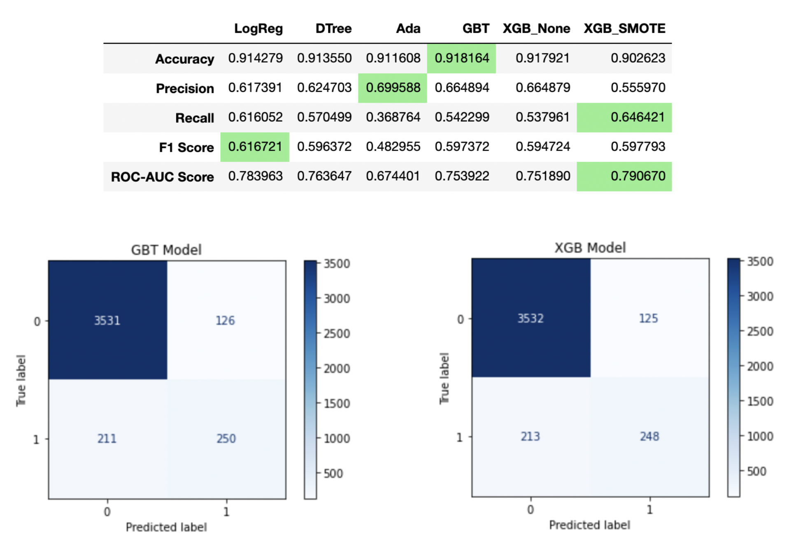
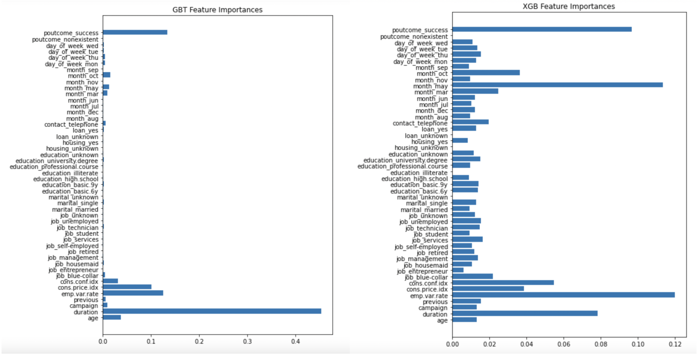
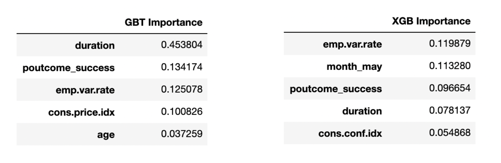
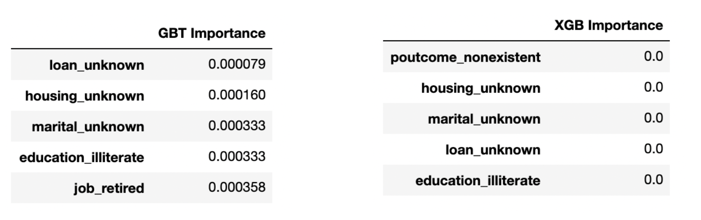

# Bank Marketing Campaign Subscriptions

## Purpose of This Project:
As a Data Scientist on a software marketing team, a model predicting whether or not a prospective lead would be an appropriate target for a marketing campaign could be invaluable to sales teams in multiple industries. While this project uses data from a Portuguese bank campaign from about 10 years ago, so it is rather old, a number of the elements of in this data are reminiscent of the very immediate problem facing my team. It blends both socio-economic factors and demographic information about the clients and it also suffers from massive class imbalance problems. I will be using three approaches to address class imbalance:

- No class balancing
- Undersampling the majority class
- Data generation in the minority class using Synthetic Minority Oversampling Technique or SMOTE

My intention is to practice techniques and the different approaches requirement to modeling class imbalanced datasets for application to current real-world datasets.

## Objective:
To determine the most important factors that affect whether or not a prospective client of a marketing campaign will purchase a subscription for a Portuguese bank. The data includes a massive amount of information, both regarding the client and the state of the economy at the time of the solicitation. 

## The Data:
A detailed description of the data and its source can be found at https://www.kaggle.com/pankajbhowmik/bank-marketing-campaign-subscriptions. Columns include factors such as:

- Demographics (e.g. Age, job, marital status etc.)
- Previous campaign history (i.e if they purchased a previous product)
- Contact Method (e.g. phone, day of the week)
- Macro-economic factors (e.g. employment rate, consumer confidence index)

### Class Imbalance

This data concerns cold calls to bank customers, so it makes sense that there are far more failures than successes. This is very similar to other sales environments, where Top of the Funnel sales have to call a lot of leads in order to create opportunities for a sale. The ratio of failure to success is 88.9% vs. 11.1%. This means that any model that I train, must have an accuracy score of higher than 89% or else it won't be any better than a blind guess of a failure. It also means that an Accuracy Score might not be the ideal metric to measure against simply because there isn't much room for improvement, but other metrics will be far more illuminating.

## Method:

I will be explorating multiple classification models using accuracy and the f1_score to evaluate their effectiveness. Knowing the most important factors, and even probabilities of whether or not a prospect will purchase a subscription, will help future marketing campaigns allocate resources most effectively. In this case, both False Negatives and False Positives can be problematic, as the marketing campaign might focus too much energy on False Positives if our Precision is low and they might miss out on solid prospectives if the Recall score is too low. I will be examining all of the above, but the overall effectiveness of the model will primarily focus on a blend of Accuracy, Precision, Recall, F1-Score and ROC-AUC. I used GridSearch for model tuning which maximized the model's F1-Score to strike the best possible balance between Precision and Recall.

I will use the following models to investigate the data:

- Logistic Regression
- K Nearest Neighbors
- Gaussian Naive Bayes
- Basic Decision Tree
- Ada Boosted Random Forest
- XGBoosted Random Forest

I will create two versions of each model: a baseline with no hyperparameter tuning and a tuned model using Sci-Kit Learn's GridSearch module.

Important to note, all scores included will be on the testing data, not the training data. I also created a **holdout** dataset which is 10% of the total data randomly sampled before any testing began. The reason I did this was because I was measuring multiple models against the same test set, the end goal is to determine any underlying patterns in ALL of the data. By testing against the same test set over and over again, I might accidentally 'overtrain' the model selection process to a single test set. Therefore, after building the best version of each model, I will do a final comparison against the holdout set to make sure the success is not a fluke.

## Final Comparison

After evaluating the best version combination of parameters and datasets, I determined the final I measured the following models against one another on the holdout dataset:

    - Logistic Regression Gridsearch with the None Dataset
    - Decision Tree Gridsearch with the None Dataset
    - Ada Boosted Tree with the None Dataset
    - Gradient Boosted Tree with the None Dataset
    - XGBoosted Tree with the None Dataset
    - XGBoosted Tree with the SMOTE Dataset

Here are the results of the comparison:

# Conclusions

In the end, the XGBoosted Model and the Gradient Boosted Models were the most successful on the Holdout data. Surprisingly, transforming the data to account for class imbalance wasn't as helpful as first assumed. It was a good practice to see what models performed better and, depending on the measure we wanted to optimize, each data set had different strengths. While both models had almost exactly the same scores, they had different feature importances. 

## Model Quality
It is important to note that, with a baseline model, predicting that a sale would be unsuccessful would be correct ~89% of the time. Our final model had an accuracy of 91.8% on the holdout data set, so it is not much more accurate than the baseline. These models do highlight more True Positives than False Positives, which is good in a sales environment, so you don't dedicate resources to the wrong prospects. They did however produce almost as many False Negatives as False Positives, so they will miss a number of good prospects while providing a solid number of successful sales. If your business strategy is less dependent on volume and more focused on closing better deals, this trade off is the best of two evils.

## Data Set
For precision and accuracy, the None dataset almost always outperformed the others. While the sampled (and smaller) dataset had the worst precision and accuracy, it usually had the best ROC-AUC, F1 and Recall scores. Finally, SMOTE tended to be a split between the two.

## Model Selection
Using the XGBoosted and Gradient Boosted models had the best performance overall on the untampered holdout data set. It's clear that KNN is simply not feasible on a dataset with 40k rows and, even when it did complete, it was inaccurate compared to the others. Logistic Regression worked well, comparatively, but a gradient boosted decision tree seems to be the most successful option.

## Demographics or Firmographics?
Based on the feature importance of the model, it was surprising to see which features were the most important and which were the least.

### Most Important:

Interestingly, the two models had several similarities in which features were important, the weight of each is very different. Here are a few take-aways

    1. Duration is a key factor in both models but drastically more important in GBT
    2. When the person was called mattered with the XGB model, but not the GBT
    3. If they previously subscribed to a campaign was essential to both
    4. The employment rate was important for both
    5. Consumer Confidex Index/price were important for both
    6. Age was a factor in GBT but not XGB

Let us break each of these down. 

**1)** Duration of the call is more of an indicator that the sale will go through, rather than the basis of a calling strategy. The fact that the call is a success is probably the deciding factor in the length of the call rather than the longer the call the more likely it will be a successful sale. One should not train sales people to just drone on in order to sell a subscription. That said, if a call is going a long time, there's a good chance it will end in a sale.

**2)** the May factor might be a case of confirmation bias. 33% of the calls were made in May, so it would make sense that a higher number of successful calls occurred then as well. This might be because the company carrying out this campaign might have already noticed an uptick in subscriptions in the month of May and therefore decided to allocate resources to emphasize that, or it might simply be due to the fact that the company had more staff during that month in order to increase volume. Perhaps there is an underlying link between the beginning of Summer and consumer purchasing habits.

**3)** It makes perfect sense that someone who previously subscribed to a similar campaign would subscribe to another one. This means that pursuing your current client list for growth opportunities will almost always be a good use of resources.

**4)** When the employment rate is higher, you sell more subscriptions. This makes sense but it means that larger economic metrics might be the most influential factors when it comes to sales success. If more people are fully employed, they'll have more disposable income for a subscription. It's also telling that the fifth most important factor is the consumer confidence index for XGB and fourth for GBT.

**5)** While the consumer confidence index and consumer price index are not necessarily the same thing, they are somewhat linked. The confidence index is a measure of optimism of the consumer with regards to the economy and the price index is a measure of the fluctation of pricing on consumer goods. Once again, this encourages me to explore macro-economic factors when exploring future models of this kind.

**6)** Age seems like a sensible measure when it comes to determining a sales success, though I don't think that means the older the client, the more likely the sale. Rather, identifying consumers in certain age ranges is helpful information when in a sales environment.

Now, let's look at the opposite list.

### Least Important:

Both models have massive similarities in terms of what is least important. In no particular order, they are:

    1. Housing status unknown
    2. Unknown Marital Status
    3. Unknown Loan Status
    4. Illiterate
   
Other than illeteracy, the majority of these factors are based on the fact that we didn't have information for those prospects. All we can glean from this is that the more data we have about our prospect, the better we can predict their interest in a subscription, which is no surprise. Lastly, it makes sense that someone who is illiterate is unlikely to purchase a financial product.

## Applying This Elsewhere

While this dataset doesn't directly apply to business to business marketing and sales, there are a number of lessons that can be gleaned from this model. First and foremost, I explored a methodology of approaching a heavily imbalanced classification problem. The key takeaways are:

    1. When considering data transformations, both SMOTE and leaving the data imbalance alone are preferable to sampling the data to a smaller dataset.
    2. More data is better than less
    3. Macro Economic Factors can be a helpful indicator of purchase intent
    4. Past purchase history with your company is a good indicator of purchase intent.
    5. The demographics of the actual individual are not nearly as important as the timing of the sales call
    6. F1 Score is a much more preferable to accuracy when scoring a class imbalance model.
    7. Gradient Boosting is a powerful modeling tool and should be considered first or second (behind Logarithmic Regression) whenever building a new model of this kind. Logistic Regression also performed very well.
    8. If possible, create a holdout set of data to test a final model to ensure you don't accidentally train to the testing data.
    
This project is useful for helping direct resources when data gathering as well. Since the customers with the least information were the least predictable, it would be useful to gather information. Most importantly, however, we must be wary of correlation vs. causation when selecting variables. Creating KPIs based on only making sales calls in May and making the calls as long as possible would be a poor managerial choice. That said, when the employment rate goes up, and the consumer confidence is high, it might be a good time to get calling clients.

## Areas of Further Study

The next step would be to build a dataset of this size for business to business interactions. While demographics for the individual prospect might not have been as important as macro-economic factors, firmographics for the companies purchasing new products might be very useful information. Future models should not include factors that are affected by the success of the call, it should only include factors that might affect the outcome itself. That way, the model will be able to highlight best sales practices, rather than best indicators or a sale that has already occurred.

This project will be invaluable in determining data collection next steps and the tools used are appropriate for evaluating and building models for similar problems in the future.